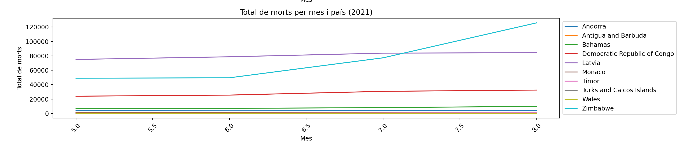

# Exercici A de l'Activitat

Anàlisi de dades sobre la COVID-19 en diversos països.

## Gràfica 1: Total de casos per mes i país

Aquesta gràfica il·lustra el total de casos de COVID-19 per mes en 10 països diferents que sempre son els mateixos. Agafant els 10 països que tenen els més casos.

## Gràfica 2: Total de morts per mes i país

A la segona gràfica, es mostren les morts totals per mes en 10 països, cada vegada que s'executa el codi agafa 10 països diferents. 

## Gràfica 3: Taxa de reproducció per mes i país

Aquesta gràfica presenta la taxa de reproducció del virus per mes en 10 països que també canvien per cada execució del codi.

## Exercici 3 

## Gràfica de Clock Speed per ID de Mòbil

Aquesta gràfica mostra la velocitat del processador dels diferents mòbils, identificats pel seu ID. ens permet saber a quina velocitat funciona cada model.

## Gràfica de Megapíxels per ID de Mòbil

Aquí es comparen els megapíxels de les càmeres dels mòbils. Cada barra indica la capacitat de captura d'imatge del mòbil corresponent.

## Gràfica de Battery Power per ID de Mòbil

Aquesta gràfica mostra la capacitat de bateria dels mòbils en miliamperis hora (mAh). Mostra quant de llarga pot ser la durada de la bateria de cada mòbil sota ús normal.