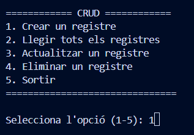
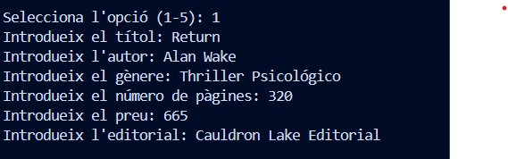
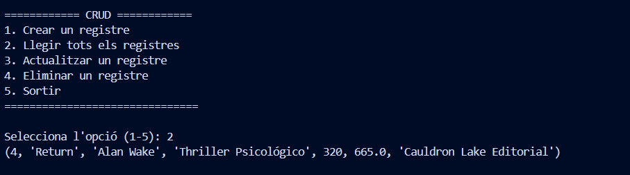
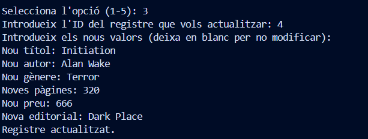
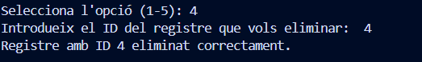

# Activitat CRUD

Mostra les operacions CRUD (Crear, Llegir, Actualitzar, Eliminar) realitzades sobre una taula en una base de dades.

## Menú d'inici

### Captura de pantalla

El Menú d'inici del programa

---

## 1. Crear un registre

### Captura de pantalla

S'ha executat l'operació de crear un registre a la taula. S'han introduït les dades del nou llibre, que inclouen el títol, l'autor, el gènere, el número de pàgines, el preu i l'editorial.

---

## 2. Llegir els registres

### Captura de pantalla

S'ha realitzat la consulta per llegir tots els registres de la taula. Els resultats mostren una llista de llibres que s'han inserit prèviament a la base de dades.

---

## 3. Actualitzar un registre

### Captura de pantalla

Es mostra l'actualització d'un registre existent. S'han introduït nous valors per al títol, l'autor o altres camps del registre seleccionat, permetent així modificar la informació d'un llibre.

---

## 4. Eliminar un registre

### Captura de pantalla

Com s'elimina un registre de la taula. L'usuari selecciona un ID de registre existent, i la comanda per eliminar-lo s'ha executat correctament.
